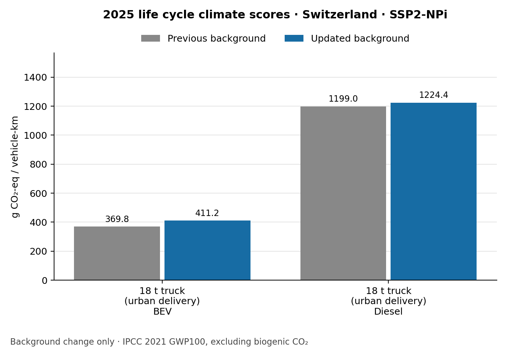

Validation examples: what the comparisons show
==============================================

A completed calculation is necessary but is not enough to establish that the
vehicle represents reality. This page separates comparisons with reported energy
use, checks of the calculation, and changes caused by the background database.
See :doc:`interpretation` for units and :doc:`validity` for detailed checks.

The figures reproduce **saved audits from October 2026**. This documentation
review replotted their recorded numbers; it did not rerun every model or fit
new parameters. Sources and software revisions belong to each audit, so these
figures should not be described as measurements of the latest software release.

How to make a fair energy comparison
------------------------------------

Match the vehicle and year, the second-by-second speed and road gradient, test
mass, resistance coefficients, temperature, auxiliary loads, and fuel or battery
properties. State where energy was measured. Charging electricity includes
losses that a battery-terminal measurement excludes. If a test mass is
reconstructed from curb mass and a documented payload, label it as reconstructed
rather than weighed.

The 9 October family evidence review retained 41 paired observations from 40
runs and excluded 77 other observations with recorded reasons. **All 41 pairs
remain screening comparisons under that review's strict matching rules.** This
is not a count of independently validated vehicles, and the earlier use of two
bus cycles to fit an auxiliary load does not change that classification.
Multiple cycles or meter locations on one vehicle share evidence.

Delivery trucks: match resistance as well as mass
-------------------------------------------------

.. figure:: _static/validation/truck_energy.png
   :alt: Smith electric and MT45 diesel delivery-truck model comparisons using default and documented road loads

   Saved delivery-truck diagnostics, including documented test-mass and
   resistance settings. The historical Smith Newton and MT45 tests are compared
   with 2025 vehicle technology assumptions. They are not a calibration of new
   2025 trucks. The AC and DC results for Smith are two energy boundaries on the
   same vehicle, not independent vehicles.

With the documented Smith resistance curve, the OCBC-cycle model gives
44.99 kWh/100 km at the battery terminals versus 44.74 reported (+0.6%). Charging
input is 52.42 versus 54.68 kWh/100 km (−4.1%). For the MT45, using documented
resistance and disabling generic hybridization gives 21.32 versus 24.71 L/100 km
on OCBC (−13.7%) and 30.42 versus 38.69 on NYCC (−21.4%).

These cases show why driving mass alone is insufficient: resistance and
powertrain configuration also matter. The MT45 evidence concerns a 2006 vehicle
tested in 2009; changing current truck efficiency to match it would mix technology
years. Heavy electric-truck road reports reviewed elsewhere also have unmatched
routes and unclear electricity-meter locations, so no single percentage error
can be treated as validation of those classes.

See `the truck diagnostic guide <https://github.com/Laboratory-for-Energy-Systems-Analysis/carculator_utils/blob/master/docs/truck_energy_diagnostics.rst>`_ for source resistance coefficients, cycle checks, all 20 saved
cases and the remaining evidence gaps.

Change in life cycle climate scores
-----------------------------------

The next chart compares **two calculations**, not model outputs with measured
emissions. Both use the same 2025 vehicle inputs and national electricity-supply
settings in Switzerland. Only the bundled background inventory/index and impact
coefficients were changed. The updated bundle was rebuilt with premise and
ecoinvent 3.12 cutoff. The previous bundle is identified by Git revision
``aeace0e53937870fa05ec8aeba392e41d75aaa0b``; it should not be described as a clean
older-ecoinvent baseline because it already contained some newer coefficients.

The displayed scenario is ``SSP2-NPi``. Results are grams CO2-equivalent per
vehicle-km, using IPCC 2021 GWP100 excluding biogenic CO2 within the ``recipe``
midpoint collection. Vehicle masses and consumption were unchanged: all 138
recorded physical outputs matched exactly. The full audit covers 96 combinations
of eight vehicles, three years and four background scenarios.

   Model-to-model background comparison, not measured validation.
   :download:`Values <_static/validation/climate_truck.csv>`.

Traceable results
-----------------

Download the :download:`plotted values and source checksums
<_static/validation/plot_inputs.json>` and :download:`source manifest
<_static/validation/source_manifest.json>`. The JSON stores observation IDs and,
where recorded in the comparison table, original source URLs. Sources for the
reused diagnostic figures are listed in their linked method pages.

The shared `background-rebuild guide <https://github.com/Laboratory-for-Energy-Systems-Analysis/carculator_utils/blob/master/docs/background_rebuild.rst>`_ contains the
complete climate CSV, software revisions, rebuild report and comparison command.
The `energy evidence guide <https://github.com/Laboratory-for-Energy-Systems-Analysis/carculator_utils/blob/master/docs/energy_measurements.rst>`_ provides the original
measurement catalog, exclusions and run records. These are reproducibility
records, not new evidence of external accuracy.

To redraw the new bar charts from saved results, run from ``carculator_utils``
with Matplotlib installed::

   python scripts/plot_documentation_validation.py --output /tmp/validation-plots

The plotting script does not recalculate vehicles. Reproducing a model audit
requires the matching source revisions and inputs recorded in that audit.
